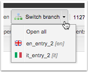
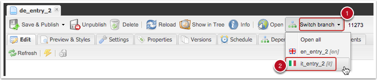
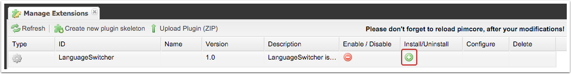
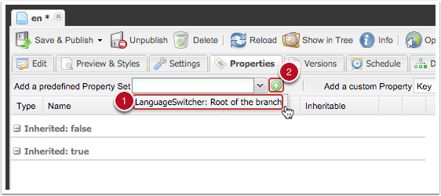
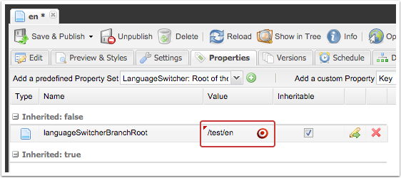

# Pimcore plugin: LanguageSwitcher

LanguageSwitcher is a Pimcore plugin that makes managing multi-lingual websites a whole lot easier and straightforward. Its main function is to find related nodes in parallel branches and to easily create menus for jumping to the same subpage in other languages - in the frontend and in the backend.

Switching between branches is very easy. You can also open current page in all languages at once.



If there is no coressponding page in other branch, then the parent node is returned.

## Frontend language menu

Integrating language menu to your website is as easy as adding this to view:

```php
// This example links to parallel pages but has a label of a branch (eg. En, It, De, Ja)
<ul>
    <?php
    $languageSwitcher = new LanguageSwitcher\Switcher($this->document);
    foreach ($languageSwitcher->getEntries() as $entry) {
        $path = $entry->getPath();
        $isActiveClass = $entry->isActive()?"active":"";
        echo "<li class=\"{$isActiveClass}\"><a href=\"{$path}\">" . $entry->getBranchLabel() . "</a></li>";
    }
    ?>
</ul>
```

```php
// This example links to parallel pages but has a label of a branch (eg. En, It, De, Ja)
<ul>
    <?php
    $languageSwitcher = new LanguageSwitcher\Switcher($this->document);
    foreach ($languageSwitcher->getEntries() as $entry) {
        $path = $entry->getPath();
        $isActiveClass = $entry->isActive()?"active":"";
        echo "<li class=\"{$isActiveClass}\"><a href=\"{$path}\">" . $entry->geLabel() . "</a></li>";
    }
    ?>
</ul>
```

## Switching between branches in the backend


You can either switch/open just one language or open a page in all languages at once. This makes it very easy to edit one page in multiple languages.

## Installing
Add this line to the ```require``` section of your composer.json and install it with composer:
```
```

Install it from Extension manager:



This adds predefined property for selecting branch roots and website setting for selecting the parent node.

### Set parent node
If your language structure is like this you don't need to change the parent node:
```
Home:
- en
- de
- it
```

If you have language nodes in a subfolder like this than you need to set it as a parent node in Website Settings:
```
Home:
- languages
    - en
    - de
    - it
```

### Set branch roots
Branch roots must be direct descendants of the parent node. You need to add a property with key ```languageSwitcherBranchRoot``` to each branch root. The property MUST be inheritable. Plugin setup procedure creates a predefined property for you that you can use.
After you create the property, drag and drop the branch root to Value field of property.





## Copyright and license
**Developed by: Igor Benko**

**License: BSD-3-Clause**
